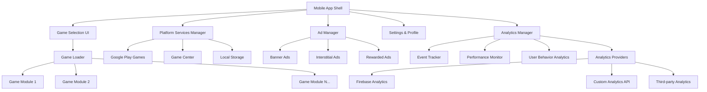

# Multi-Game Platform Design Document

## Overview

The Multi-Game Platform is a cross-platform mobile application that provides users with access to multiple simple games within a single app. The platform features a scalable game selection interface, integrated monetization through advertisements, platform-specific gaming services integration, and comprehensive accessibility support.

### Key Design Principles
- **Modular Architecture**: Each game is a self-contained module that can be independently developed and updated
- **Platform Integration**: Leverage native gaming services (Google Play Games, Game Center) for enhanced user engagement
- **Accessibility First**: Ensure WCAG 2.1 AA compliance across all games and interfaces
- **Performance Optimization**: Maintain smooth 30+ FPS gameplay while managing memory efficiently
- **Scalable Monetization**: Strategic ad placement that doesn't disrupt user experience

## Architecture

### High-Level Architecture



### Technology Stack

**Framework**: React Native with Expo
- Cross-platform development with native performance
- Strong ecosystem for gaming and ads integration
- Built-in support for platform gaming services
- Excellent accessibility support

**Game Engine Integration**: 
- React Native Game Engine for simple 2D games
- Expo GL for hardware-accelerated graphics when needed
- Custom game modules using Canvas API for lightweight games

**Platform Services**:
- Google Play Games Services SDK for Android
- Game Center framework for iOS
- AsyncStorage for local data persistence
- Expo SecureStore for sensitive data

**Advertisement Integration**:
- Google AdMob for primary ad serving
- Facebook Audience Network as secondary provider
- Expo Ads for simplified integration

**Analytics Integration**:
- Firebase Analytics for comprehensive user behavior tracking
- Custom analytics API for business-specific metrics
- Expo Analytics for basic app performance metrics
- Pluggable analytics providers for future expansion

## Components and Interfaces

### Core Components

#### 1. App Shell (`AppShell.tsx`)
```typescript
interface AppShellProps {
  initialRoute?: string;
}

interface AppState {
  currentScreen: 'menu' | 'game' | 'settings';
  selectedGame?: GameModule;
  userProfile: UserProfile;
  platformServices: PlatformServicesState;
}
```

#### 2. Game Selection Grid (`GameGrid.tsx`)
```typescript
interface GameGridProps {
  games: GameModule[];
  onGameSelect: (game: GameModule) => void;
  userProgress: UserProgress;
}

interface GameTile {
  id: string;
  title: string;
  description: string;
  icon: ImageSource;
  highScore?: number;
  isAvailable: boolean;
  accessibility: AccessibilityInfo;
}
```

#### 3. Game Module Interface
```typescript
interface GameModule {
  id: string;
  metadata: GameMetadata;
  component: React.ComponentType<GameProps>;
  achievements: Achievement[];
  leaderboardConfig: LeaderboardConfig;
}

interface GameProps {
  onGameEnd: (score: number, stats: GameStats) => void;
  onPause: () => void;
  onExit: () => void;
  userSettings: GameSettings;
  accessibility: AccessibilitySettings;
}
```

#### 4. Platform Services Manager (`PlatformServices.ts`)
```typescript
interface PlatformServicesManager {
  initialize(): Promise<void>;
  signIn(): Promise<UserProfile>;
  submitScore(gameId: string, score: number): Promise<void>;
  unlockAchievement(achievementId: string): Promise<void>;
  getLeaderboard(gameId: string): Promise<LeaderboardEntry[]>;
  syncProgress(): Promise<void>;
}
```

#### 5. Advertisement Manager (`AdManager.ts`)
```typescript
interface AdManager {
  initializeAds(): Promise<void>;
  showBannerAd(position: 'top' | 'bottom'): void;
  showInterstitialAd(): Promise<boolean>;
  showRewardedAd(): Promise<AdReward>;
  hideBannerAd(): void;
}
```

#### 6. Analytics Manager (`AnalyticsManager.ts`)
```typescript
interface AnalyticsManager {
  initialize(): Promise<void>;
  trackEvent(event: AnalyticsEvent): void;
  trackScreen(screenName: string, properties?: Record<string, any>): void;
  trackGameplay(gameId: string, metrics: GameplayMetrics): void;
  trackUserAction(action: UserAction, context?: Record<string, any>): void;
  trackPerformance(metrics: PerformanceMetrics): void;
  setUserProperties(properties: UserProperties): void;
  flush(): Promise<void>;
}

interface AnalyticsEvent {
  name: string;
  properties?: Record<string, any>;
  timestamp?: Date;
  userId?: string;
}

interface GameplayMetrics {
  gameId: string;
  sessionDuration: number;
  score: number;
  completed: boolean;
  difficulty?: string;
  achievements?: string[];
}

interface PerformanceMetrics {
  screenLoadTime: number;
  memoryUsage: number;
  frameRate: number;
  crashReports?: CrashReport[];
}
```

### Game Architecture Pattern

Each game follows a standardized structure:

```
games/
├── game-template/
│   ├── GameComponent.tsx      # Main game UI
│   ├── GameLogic.ts          # Game state and rules
│   ├── GameRenderer.ts       # Graphics and animations
│   ├── GameAudio.ts          # Sound effects and music
│   ├── GameAccessibility.ts  # Accessibility features
│   └── GameConfig.ts         # Game metadata and settings
```

## Data Models

### User Profile
```typescript
interface UserProfile {
  id: string;
  displayName?: string;
  platformId?: string; // Google Play or Game Center ID
  preferences: UserPreferences;
  statistics: GlobalStatistics;
  achievements: Achievement[];
  createdAt: Date;
  lastActive: Date;
}

interface UserPreferences {
  soundEnabled: boolean;
  musicEnabled: boolean;
  soundVolume: number;
  musicVolume: number;
  reducedMotion: boolean;
  highContrast: boolean;
  fontSize: 'small' | 'medium' | 'large';
  notifications: NotificationSettings;
}
```

### Game Progress
```typescript
interface GameProgress {
  gameId: string;
  highScore: number;
  totalPlays: number;
  totalTime: number;
  averageScore: number;
  achievements: string[];
  statistics: GameStatistics;
  lastPlayed: Date;
}

interface GameStatistics {
  [key: string]: number | string | boolean;
}
```

### Advertisement Data
```typescript
interface AdConfiguration {
  bannerAdUnitId: string;
  interstitialAdUnitId: string;
  rewardedAdUnitId: string;
  frequency: AdFrequency;
  targeting: AdTargeting;
}

interface AdFrequency {
  interstitialCooldown: number; // seconds
  maxInterstitialsPerSession: number;
  bannerRefreshRate: number; // seconds
}
```

### Analytics Data
```typescript
interface UserAnalytics {
  userId: string;
  sessionId: string;
  deviceInfo: DeviceInfo;
  appVersion: string;
  installDate: Date;
  lastActiveDate: Date;
  totalSessions: number;
  totalPlayTime: number;
  favoriteGames: string[];
  userSegment: UserSegment;
}

interface SessionAnalytics {
  sessionId: string;
  startTime: Date;
  endTime?: Date;
  duration?: number;
  screensVisited: string[];
  gamesPlayed: GameSession[];
  adsViewed: AdInteraction[];
  crashes: CrashReport[];
  performanceMetrics: PerformanceSnapshot[];
}

interface GameSession {
  gameId: string;
  startTime: Date;
  endTime?: Date;
  duration?: number;
  score: number;
  completed: boolean;
  difficulty: string;
  achievements: string[];
  userActions: UserAction[];
}

interface UserAction {
  type: 'tap' | 'swipe' | 'navigation' | 'purchase' | 'share';
  target: string;
  timestamp: Date;
  context?: Record<string, any>;
}

interface AdInteraction {
  adType: 'banner' | 'interstitial' | 'rewarded';
  adProvider: string;
  timestamp: Date;
  duration?: number;
  clicked: boolean;
  revenue?: number;
}

enum UserSegment {
  NEW_USER = 'new_user',
  CASUAL_PLAYER = 'casual_player',
  REGULAR_PLAYER = 'regular_player',
  POWER_USER = 'power_user',
  CHURNED_USER = 'churned_user'
}
```

## Error Handling

### Error Categories and Strategies

#### 1. Network Errors
- **Ad Loading Failures**: Graceful degradation, continue without ads
- **Platform Service Errors**: Fall back to local-only mode
- **Leaderboard Sync Issues**: Queue for retry, show cached data

#### 2. Game Runtime Errors
- **Game Crash Recovery**: Auto-save game state, offer resume option
- **Performance Issues**: Dynamic quality adjustment, memory cleanup
- **Input Errors**: Validate all user inputs, provide clear feedback

#### 3. Platform Integration Errors
- **Authentication Failures**: Offer guest mode, retry mechanisms
- **Achievement Unlock Failures**: Queue for retry when connection restored
- **Cloud Save Conflicts**: Merge strategies with user choice

### Error Handling Implementation
```typescript
interface ErrorHandler {
  handleGameError(error: GameError, gameId: string): void;
  handlePlatformError(error: PlatformError): void;
  handleAdError(error: AdError): void;
  reportError(error: Error, context: ErrorContext): void;
}

enum ErrorSeverity {
  LOW = 'low',        // Log only
  MEDIUM = 'medium',  // Show user notification
  HIGH = 'high',      // Block functionality
  CRITICAL = 'critical' // App restart required
}
```

## Testing Strategy

### Testing Pyramid

#### 1. Unit Tests (70%)
- Game logic validation
- Score calculation accuracy
- Achievement trigger conditions
- Data model validation
- Utility function testing

#### 2. Integration Tests (20%)
- Platform services integration
- Ad manager functionality
- Game module loading
- Data persistence
- Cross-component communication

#### 3. End-to-End Tests (10%)
- Complete user journeys
- Game selection and play flow
- Achievement unlock flow
- Leaderboard submission
- Ad display and interaction

### Accessibility Testing
- Screen reader compatibility testing
- Keyboard navigation testing
- Color contrast validation
- Font scaling testing
- Motor accessibility testing

### Performance Testing
- Memory usage monitoring
- Frame rate consistency
- Battery usage optimization
- Load time measurement
- Stress testing with multiple games

### Platform-Specific Testing
- Google Play Games Services integration
- Game Center functionality
- Device-specific performance
- Different screen sizes and orientations
- Platform store compliance

### Testing Tools and Frameworks
- **Jest** for unit testing
- **Detox** for E2E testing
- **Flipper** for debugging and performance monitoring
- **Accessibility Inspector** for accessibility validation
- **Firebase Test Lab** for device testing
- **TestFlight/Internal Testing** for beta testing

## Security Considerations

### Data Protection
- Encrypt sensitive user data using platform secure storage
- Implement proper session management
- Validate all user inputs to prevent injection attacks
- Use HTTPS for all network communications

### Privacy Compliance
- COPPA compliance for users under 13
- GDPR compliance for European users
- Clear privacy policy and data usage disclosure
- Minimal data collection principle

### Ad Security
- Verify ad network security standards
- Implement ad fraud prevention
- Monitor for inappropriate ad content
- Secure ad revenue tracking